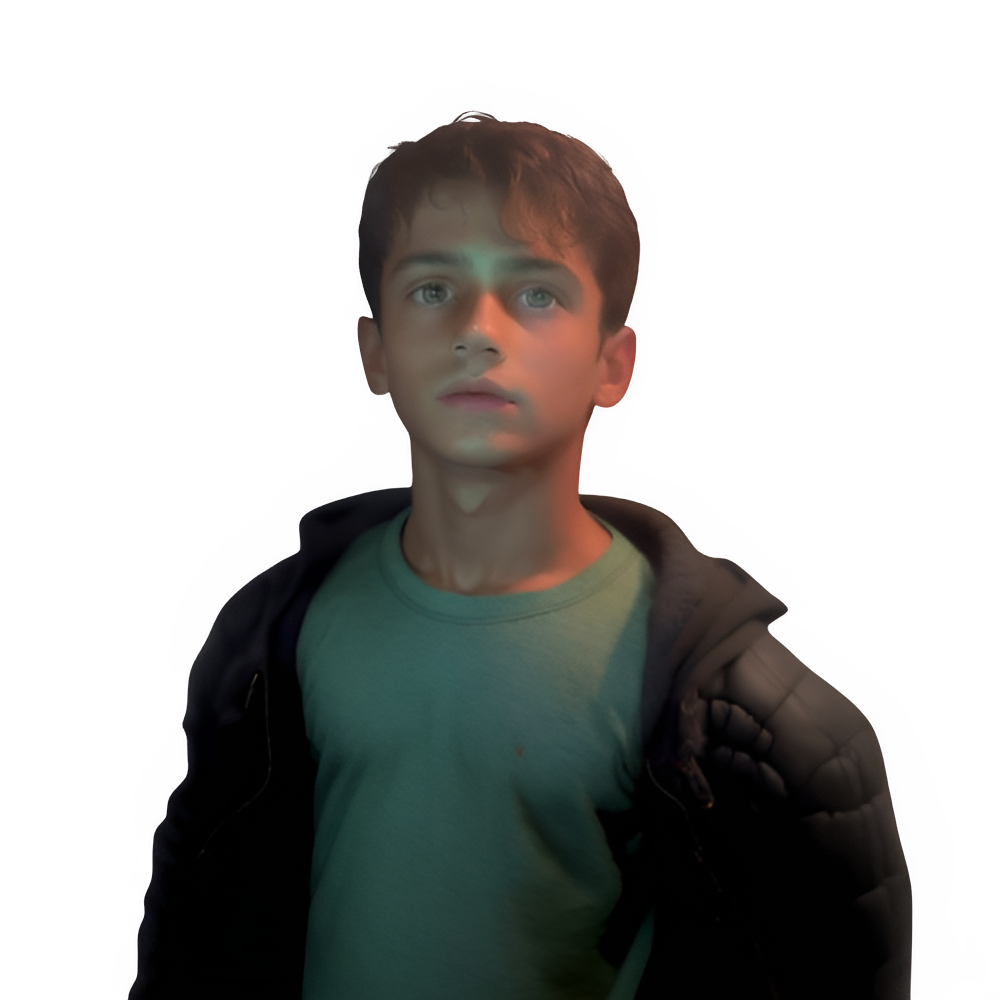

<h1 align="center"><b>Hey , I'm Ahmed Zahri </b></h1>

  

<!--  Ceci mon Avatar-->

<!--  About me -->
<!--## <picture></picture> **About me**-->
**About me**

I'm Ahmed ZAHRI, a passionate Technician in Digital Infrastructure – Systems & Networks 🖥️🛠️, with a strong drive for solving technical challenges and improving IT environments. I specialize in system administration (Windows & Linux), network configuration, virtualization, and IT supervision solutions like Zabbix. Whether it’s managing servers, deploying OS images, configuring network switches, or setting up monitoring dashboards, I enjoy turning complex infrastructure into reliable, efficient systems. I'm always looking to learn, grow, and contribute to impactful IT projects. Let’s optimize, automate, and secure the digital world together!

<!-- Let's Connect..! -->
# <b> Let's Connect..!</b>

<!-- YouTube Channel Views /GitHub followers /visitors/Age  -->

<!---->

<!-- Ligne  -->
  
<!-- TODO: Add last video link 
